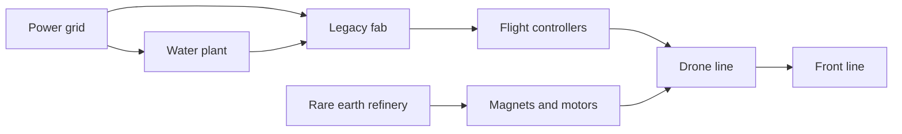
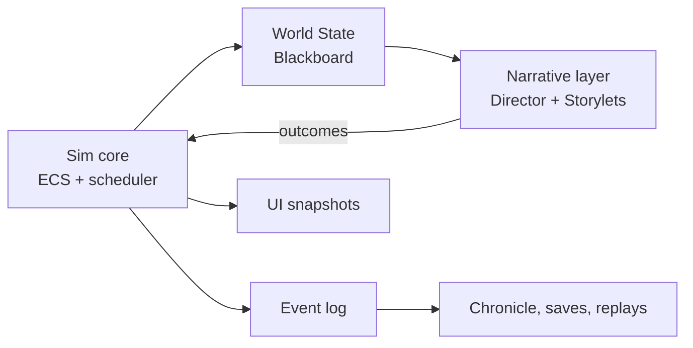

# CASCADE — Game Concept Document

Sep 23, 2026 · @Beno

## Working title & elevator pitch

**CASCADE** is a near-future grand strategy game where every nation runs on a web of fragile dependencies. Your job is to keep yours standing while rivals quietly pull the threads.

*Tagline: Every system is load-bearing.*

**Elevator pitch.** Hearts of Iron's production depth, rebuilt for a world where a chip shortage can lose a war and a deepfake can topple a cabinet. The most strategic object on the map is a 400-ton power transformer with a three-year lead time. Build an army from almost nothing, annex the mineral-rich province next door, then discover that holding it is the hard part. A Story Director watches your simulation and turns it into a political thriller, starring people you come to know by name.

**The core fantasy.** You are not a general. You are *the Office*: the head of government in a situation room at 3 a.m., deciding which city loses power so the chip fab can keep running. Leaders come and go through elections and scandals, but the Office, and the player, continues.

**Setting.** 2031 to 2050, on a real-scale world map with around 40 playable nations. Launch recommendation: fictional nations with clear real-world analogs, so the game never dates and no real conflict is sold as a product. A real-world map can follow as a mod layer.

**Borrowed DNA**

| Game | What CASCADE takes | What CASCADE changes |
| --- | --- | --- |
| Hearts of Iron IV | Production lines, fronts, supply, division design | Supply is a web of chips, minerals, power and data, not steel and oil |
| Victoria 3 | Population groups, interest groups, markets | Adds corporations as independent actors and an information layer |
| Crusader Kings III | Characters with ambitions, secrets and memory | Characters live inside a modern state: ministers, CEOs, journalists, hackers |
| RimWorld | A storyteller AI that paces drama | Storytellers pace political and societal arcs, not raids |
| Frostpunk | Moral triage under scarcity, laws that stick | Precedents that permanently shift what your society accepts |

## Design pillars: what makes it fun

Seven rules every system must serve. If a feature doesn't feed at least one, it gets cut.

1. **Everything connects, everything breaks.** The world is one dependency web. A failure in one node travels, and watching a cascade spread is CASCADE's version of a tank breakthrough.
2. **Triage is the game.** You never have enough power, chips, political capital or attention. The fun is choosing what to sacrifice, and living with it.
3. **Numbers have faces.** Every statistic is tied to named people the player follows for years. A blackout is a percentage and a nurse running out of generator fuel.
4. **Most wars are never declared.** The richest play space sits below open war: cyber intrusions, export controls, influence campaigns, deniable sabotage. When open war does come, peacetime preparation decides it.
5. **Power is borrowed.** Voters, factions, corporations, bond markets and allies lend you authority. Any of them can call the loan.
6. **Deep simulation, readable surface.** Any number can answer "why?" in two clicks, tracing a drone shortfall back to one magnet shipment.
7. **Taking is fast; holding is slow.** An army can seize a province in weeks. Making it yours takes years, and the whole world watches how you do it.

**Signature moments we are designing for**

- Watching a blackout roll town by town across the Grid lens while the Blackout Clock counts down.
- Discovering the enemy drone you shot down runs on chips from your own factory.
- Pushing a firmware update to your drone fleet and flipping a stalled front in a week.
- Turning a nation of 7 million into a regional power, then watching the coalition form against you.
- The nurse you've followed for five years going on national TV to denounce you.
- Reading the end-of-campaign Chronicle, where three rival historians judge your legacy.

## Core gameplay loop

The player reads the situation, makes a call, feeds the machine, absorbs the shock, and adapts. That cycle runs every few minutes, and nests inside longer session and campaign loops.


The shock step is what makes it CASCADE: consequences arrive late, sideways, and through systems you weren't watching.

### Minute to minute

Play is pausable real time, like Hearts of Iron IV. In a typical five minutes the player does most of these:

- **Reads the Brief.** A stack of three to seven cards per in-game day: intel, polls, market moves, incidents, and requests from characters. Some cards expire if ignored.
- **Scans the lenses.** Map overlays for Flow (logistics), Grid (power), Signal (networks and spectrum), Orbit, Mood (public opinion) and Cascade (dependency risk). Red nodes pulse where failure is likely.
- **Tunes the Machine.** Rebalances production lines, reroutes shipments, sets power priorities, and adjusts stockpile targets.
- **Runs operations.** Fronts, drone campaigns, cyber operations and information campaigns.
- **Answers people.** Dilemmas where a named character needs a decision, usually with no clean option.

### Two clocks

Modern crises happen in hours, but fabs take years. CASCADE runs on two clocks.

- **Strategic Time:** one tick is one day. Construction, research, elections, diplomacy and long supply chains live here.
- **Crisis Time:** when a major event fires, affected systems drop to one tick per hour and the Situation Room opens. Blackouts, viral deepfakes and live cyber intrusions resolve at this scale, then time zooms back out.

An optional **Iron Clock** mode puts a real-time timer on Situation Room decisions, for players who want the pressure.

### Session and campaign

- **Session (1 to 3 hours):** pursue your government's Mandate, survive one or two story arcs, and push a long project such as a fab, a satellite constellation or a transformer reserve.
- **Campaign (20 to 60 hours):** 2031 to 2050, three to five governments, and wars hot or cold. It ends with the Chronicle and History's Verdict, not just a map painted one colour.

### Every nation is a different puzzle

| Archetype | Strength | Chokepoint | The puzzle |
| --- | --- | --- | --- |
| Fab Island | Leading-edge chip fabs | Imports most energy and food | Stay indispensable without becoming the target |
| Resource Giant | Refines most of the world's rare earths | Weak chip industry | Weaponize exports without pushing buyers to build alternatives |
| Middle Power | Balanced industry, strong alliances | Relies on allies for satellites and cyber | Pick a side slowly, or get picked |
| Rising Power | Money and a skilled workforce | Few soldiers, no strategic depth | Build an army fast and take what you need before a coalition forms |
| Frontline State | Cheap drones, motivated population | Tiny industrial base | Win on cost exchange before the money runs out |
| Superpower | Something of everything | Overstretched and brittle | Defend a hundred chokepoints at once |

## System 1: The Machine (logistics & engineering)

The economy is one dependency web: every product has a bill of materials, every input has a "Days of Cover" counter, and every link can break. This is where Hearts of Iron's production depth lives, updated for the silicon age.

### Five tiers of stuff

| Tier | Examples | Why it matters in play |
| --- | --- | --- |
| Raw | Lithium, cobalt, rare earth ore, gallium, germanium, copper, high-purity quartz, helium, neon, gas, fresh water | New mines take 7 to 15 years, so the map you start with matters |
| Refined | Battery-grade lithium, rare earth oxides and magnets, polysilicon, specialty gases, jet fuel | Refining, not mining, is the real chokepoint; one nation may control most of it |
| Components | Chips, battery cells, sensors, thermal optics, motors, radio modules | Where most shortages actually bite |
| Systems | Drones, missiles, vehicles, satellites, servers, grid transformers | What you build and deploy |
| Capacities | Compute, bandwidth, skilled labour, software | Can't be stockpiled; must be sustained every day |

### Chips and fabs

Chips come in three classes: **legacy** (cheap, everywhere), **advanced**, and **leading-edge** (AI compute, top sensors). Most weapons, cars and grid equipment run on legacy chips. So the chokepoint of your war economy is often a boring legacy fab, not the flagship.

Fabs are the game's cathedrals:

- **3 to 5 years to build**, needing lithography tools from a handful of foreign vendors. An export ban can freeze construction.
- **Needs** ultra-pure water, rock-steady power and scarce process engineers.
- **Yield curve:** a new fab starts around 30% yield and climbs with experience. Losing staff drops it again.
- **Fragile:** a two-second power flicker scraps every wafer in process, roughly six weeks of output.

### Bills of materials

Every system has an inspectable recipe. Here is a cheap strike drone:

| Component | Key input | Typical chokepoint |
| --- | --- | --- |
| Motors | Rare earth magnets | Magnet refining concentrated in one or two nations |
| Battery | Lithium-ion cells | Cell factories and lithium refining |
| Flight controller | Legacy microchips | Legacy fab capacity |
| Thermal camera | Germanium lenses, sensor chips | Germanium export controls |
| Radio link | Gallium-based RF chips | Gallium supply |
| Firmware | Software engineers | Talent pool, and countermeasure decay |

Each product line shows a **Sovereignty Score**: the share of its value sourced from your own or allied territory. Low scores are cheap in peacetime and terrifying in war.



The Cascade lens draws exactly this: knock out the grid and the player watches water, the fab, controllers and the front go amber one by one.

### Stockpiles and doctrine

Every critical input shows **Days of Cover** at current burn rate. A national doctrine slider runs from **Just-in-Time** to **Just-in-Case**. Just-in-Time raises efficiency and GDP growth; Just-in-Case builds buffers that cost money every month. Peacetime rewards the first. War punishes it.

### Production that fights back

- **Dual-use conversion.** Car plants can build drones and phone assembly lines can build military radios. Converting is fast but costs GDP, jobs and public mood.
- **Countermeasure decay.** Every drone and munition design loses effectiveness as the enemy adapts its jamming. The Design Bureau pushes firmware patches (cheap, small gain) or hardware revisions (retooling, big gain). The arms race runs in weeks, not years.
- **Magazine depth.** Munitions and interceptors are tracked against burn rate. Running dry is a crisis, not a modifier.

### The four networks

- **Transport:** rail, road, ports, sea lanes and straits, airlift, pipelines.
- **Power:** plants, substations, transmission lines, and large transformers. A transformer takes 2 to 4 years to replace, so a transformer reserve is a genuine strategic project.
- **Digital:** undersea cables, internet exchanges, data centres, satellite links.
- **Water:** treatment and pumping, which quietly depend on power.

Every node can be damaged. Repairs need crews and spare parts, and both are finite.

### The kill zone

Drones and constant surveillance make the last 10 to 20 km of any front a zone where supply trucks die. Kill Zone Depth grows with enemy drone density. Players respond with dispersed caches, uncrewed resupply vehicles and night movement, all of which cost something else.

### People as inputs

Skilled labour comes in pools: fab engineers, grid linemen, software developers, drone operators, medics. Calling up reservists can quietly gut your own grid repair crews. Training pipelines take years, and immigration policy is industrial policy.

Data centres also compete with homes for electricity. Training the next AI model may mean rolling blackouts in the suburbs.

## System 2: The layered battlefield

War runs on five layers at once, each with its own map lens, units and rules. Any layer can cripple the others: a cyber operation can ground an air force, and a viral video can end an offensive.

| Layer | What you control | Signature mechanic |
| --- | --- | --- |
| Kinetic | Brigades, ships, aircraft, drone units, air defence | Hearts of Iron-style fronts and battle plans, plus drone swarms and the kill zone |
| Electromagnetic | Jammers, spoofers, electronic warfare units | Jamming bubbles on the map; drones need a live link, autonomy, or both |
| Cyber | Network access, payloads, proxy groups | Access built over months, exploits burned on use |
| Orbital | Surveillance, comms, navigation and early-warning satellites | Constellation resilience and a shared debris meter |
| Cognitive | Narratives, platforms, public trust | Narratives spread like epidemics across population groups |

### Cyber: access plus payload equals effect

- **Access** is built slowly inside target networks: grid control systems, ports, banks, military logistics databases. It takes months, and every month risks discovery.
- **Payloads** are developed by your cyber command. They are single-use, because the target patches after the first strike.
- **Effects** include regional blackouts, corrupted logistics data that sends supplies to the wrong depot, ports frozen by ransomware, stolen designs, and sabotaged fab recipes that tank yields.
- **Attribution** has a risk and a delay. The world may take weeks to decide who did it, and it may guess wrong.
- **Proxies** such as criminal groups and patriotic hackers buy deniability, but have their own agendas and can go rogue.
- **Defence** means network segmentation, patching tempo, and an Analog Reserve: operators trained to run the grid by hand.

The catch: many critical networks belong to corporations you don't control, so national cyber defence is partly a negotiation.

### Orbital

Few expensive satellites are powerful but fragile; thousands of cheap ones are resilient but often privately owned. A corporation's CEO may decide whether your army keeps its satellite internet. Anti-satellite weapons create debris, tracked on a global **Debris meter**. Cross its thresholds and everyone's orbits degrade for decades, including yours.

### Cognitive: the information war

Narratives are game objects with three stats: **Virality**, **Plausibility**, and **Resonance** with each population group. They spread across platforms like a contagion, moving people from unaware to exposed to believing.

- **Defence:** counter-narratives (fast, partial), prebunking (slow, durable), takedown requests (need the platform's cooperation), regional internet shutdowns (instant, costly, and they set a precedent).
- **Deepfakes** open a Rumor Velocity window: a few hours before a narrative hits its tipping point.
- **Offence:** amplify a rival's existing divisions. It works, but detection gives them a rallying cause.
- **Trust** in institutions is the immune system. High-trust nations shrug off narratives that set low-trust nations on fire.

### AI integration

AI is a tech track with doctrine choices, and it runs on compute, which runs on chips and power. It can optimize logistics, fuse intelligence to thin the fog of war, speed payload development, and let drones fight through jamming.

The key choice is the **Autonomy Doctrine**: human-in-the-loop, human-on-the-loop, or human-out-of-the-loop. More autonomy means better performance against jamming, and more incidents: misidentification, civilian harm, friendly fire, accidental escalation. AI incidents are also a rich storylet source, such as a logistics AI that quietly starves a hospital to hit a munitions target.

### When the grid goes down

A region without power enters **Blackout State**, and a clock starts. Design values below are tunable.

| Hours dark | What fails |
| --- | --- |
| 0 | Traffic lights, card payments, elevators, water pressure in tall buildings |
| 4 to 8 | Cell towers drain their batteries; communications collapse |
| 12 to 24 | Backup water pumps run out of fuel; food and medicine spoil |
| 48 to 72 | Hospital generator fuel runs low; public order starts to break |

Responses include black-start capacity, microgrids, fuel priority lists, military generators and curfews. Cashless societies suffer faster than cash-heavy ones, a deliberate asymmetry.

### Asymmetry and cost exchange

A **Cost Exchange** meter shows what each side spends per unit of damage. Shooting down a cheap drone with an expensive interceptor wins the engagement and loses the war. Small nations can win on this meter even while losing ground.

### The Escalation Ladder

Escalation is a shared, emergent meter, not a war-declaration button. Every action carries an escalation weight, and each audience judges it differently: the rival, your allies, your public and the world. The rival's red lines are hidden; intelligence gives estimates with error bars.

| Rung | Typical actions | Who reacts |
| --- | --- | --- |
| 1. Competition | Tariffs, subsidies, talent poaching | Markets |
| 2. Grey zone | Export controls, influence ops, probing intrusions | Rival, allies |
| 3. Covert action | Sabotage, disruptive cyber attacks, proxy violence | Rival, intelligence services |
| 4. Limited kinetic | Border clashes, drone strikes, naval standoffs | Everyone |
| 5. Conventional war | Full mobilization and offensives | Everyone, alliances trigger |
| 6. Strategic strikes | Deep attacks on homeland infrastructure | Everyone; sanctions and blocs harden |
| 7. Strategic threshold | Kept abstract; crossing it ends the campaign in catastrophe | History |

## System 3: The Narrative Engine

The Narrative Engine turns simulation state into story. It has five parts: a **Cast** of persistent people, **Storylets** that fire when the world matches them, a **Director** that paces them, **Precedents** that change your society, and a **Chronicle** that remembers everything.


The loop closes: every choice writes back into the simulation, which changes which stories can fire next. Story and sandbox are the same system.

### The Cast

At any time, 40 to 80 active characters: ministers, generals, CEOs, union leaders, journalists, hackers, foreign leaders, opposition figures. Each has:

- **Competence** in a field, which sets how accurate their advice is.
- **Loyalties** to you, their faction, the nation and themselves, in some order.
- **An ambition**, stated concretely: become prime minister, take the company public, break the biggest story of the decade.
- **Secrets** you can discover and use as leverage. Blackmail works, and it sets a precedent.
- **Memory** of what you did to them and to people they care about.

Advice is biased by design. The defence minister overrates threats and the finance minister underrates them. Your job is to know your people.

### Citizen Lenses

The player follows four to six ordinary people from different regions and backgrounds: say, a border-town nurse, a fab technician, a trucker, a drone operator, a teenager with a big following. They are simulated from the same data as everything else. If their region goes dark, their story shows it.

Their lives move: they lose jobs, get called up, go viral, organize, emigrate. Some graduate into the Cast; the nurse becomes an opposition MP. They appear as short illustrated vignettes in the Brief, and the player can swap who they follow.

### Storylets

A storylet is a modular story beat with four parts:

1. **Preconditions:** queries on world state, such as "eastern grid below 60%" and "emergency powers active" and "an investigative journalist exists".
2. **Roles:** slots the Cast fills, such as "a whistleblower inside a defence contractor".
3. **Choices:** two to four options, with visible costs and hidden consequences.
4. **Outcomes:** writes back to the simulation as modifiers, new narratives, faction shifts, character memories, and new seeds.

Writers build thousands of these. The same storylet reads very differently depending on who gets cast.

### The Director

The Director watches three dials: **Tension** (how much is on fire), **Pacing** (time since the last big beat) and **Narrative Debt** (seeds planted but not yet paid off). It shapes arcs in five acts: Seed, Complication, Crisis, Resolution, Legacy.

Its signature trick is the **Chekhov system**. It plants small seeds, such as a disgruntled engineer or odd traffic on the grid network, that can pay off months later. Attentive players can spot and defuse them, which rewards reading the Brief.

Players pick a Director personality, as in RimWorld:

| Director | Style | Best for |
| --- | --- | --- |
| The Historian | Grounded, slow-burn, few coincidences | Simulation purists |
| The Thriller Writer | Conspiracies, betrayals, dramatic payoffs | Players who want a political thriller |
| The Novelist | Character-first, intimate stakes, citizen stories | Players who came for the people |
| The Chaos Engine | Black swans: solar storms, market crashes, coups | Veterans who want to be tested |

### Precedents

There is no good-or-evil meter. Instead, every hard choice sets a **Precedent**: internet shutdown, detention without trial, nationalizing a company, fully autonomous weapons, paying a ransom.

The first time is a crisis, with a big legitimacy cost and loud faction reactions. Each repeat costs less, until it becomes ordinary policy. *The first internet shutdown is a scandal; the fifth is a Tuesday.* Precedents outlive governments, so your successor inherits the society you shaped, and the opposition can campaign on undoing it.

### The Situation Room and the Fog of Truth

Major crises open the Situation Room: a full-screen scene with the map, the clock, and advisors pitching options through their biases. Intel shows a confidence level. Asking for more information costs time you may not have.

Intel can be wrong, advisors can lie, and false flags exist. You won't always learn the truth during play.

### The Chronicle and History's Verdict

Every significant event is logged as history, with headlines, dates and character quotes. At campaign end, three historians with different outlooks write their verdict on your leadership, scored on Survival, Prosperity, Liberty, Sovereignty and Humanity.

A final **Declassified** epilogue reveals what really happened: who ordered the sabotage, which advisor lied. The whole Chronicle exports as a newspaper-style front page players can share.

## System 4: Politics, population & corporate power

You govern with borrowed power. Political Capital is lent by the public, factions, corporations, markets and allies, and every one of them can call the loan.

### Population segments

Each nation has 20 to 60 segments, defined by region, livelihood and identity: capital-region tech workers, northern farmers, a border minority community, coastal retirees, the diaspora abroad. Each segment tracks:

- **Needs:** power, prices, jobs, safety, connectivity, dignity.
- **Beliefs:** fed by the narratives that reach them.
- **Trust** in institutions, which sets how easily they are misled.
- **Mobilization:** willingness to protest, strike, volunteer or enlist.

Wellbeing is felt concretely: the price of bread and fuel, hours of power a day, whether the phone works. Segments vote, protest, strike, enlist and emigrate.

### Factions and Mandates

Interest groups include the Security Establishment, Industry and Tech Capital, Organized Labour, the Green Movement, Nationalists, Civil Liberties, Faith and Tradition, and Regional Autonomists. Each has a leader from the Cast, an agenda, and leverage.

Every government arrives with a **Mandate**: a short, focus-tree-style set of goals from its campaign, such as "Bring Chips Home" or "Neutral and Armed". Completing goals earns Political Capital; abandoning them costs trust. Lose an election and you keep playing as the Office, now inside the winner's Mandate and constraints.

Democracies run on elections, coalitions and no-confidence votes. Authoritarian states run on elite loyalty, succession crises and coup risk.

### Emergency Powers

Declaring an emergency unlocks price controls, requisitioning, conscription, curfews, press limits and internet shutdowns. It is easy to declare and hard to end. Every month raises a Backsliding meter, and ending it costs capital while the Security Establishment pushes back.

There is no "change government type" button. Nations drift along four axes, open or closed information, centralized or federal, rule of law or rule by decree, market or command, as precedents and emergencies pile up. You can finish in a very different country than you started.

### Corporations as actors

Major corporations are independent players with a CEO from the Cast, assets, interests and foreign exposure. Example cast for one nation:

| Corporation | Owns | What you need from it | Its leverage over you |
| --- | --- | --- | --- |
| Tessera Semiconductor | The nation's only legacy and advanced fabs | Chips for everything | Can build its next fab abroad |
| Helion Orbital | A 6,000-satellite internet constellation | Military comms, rural connectivity | Can throttle service anywhere |
| Brightline Social | The largest social platform | Takedowns and counter-messaging | Huge user base in the rival nation |
| Ardent Defense | A fast-moving drone startup | Rapid iteration, cheap airframes | Foreign investors; poaches your engineers |
| Continental Grid | The national power utility | Hardening and repair crews | A decade of underinvestment; wants rate hikes |
| Harrow Maritime | Shipping lines and port terminals | Wartime shipping capacity | Insurers and charterers decide where ships sail |

Your tools are subsidies, contracts, regulation, pressure, partnership and nationalization, which scares investors and sets a precedent. Their responses are to comply, lobby, stall, leak, relocate, or sell to foreign buyers. A company with big revenue in the rival nation will fight your sanctions, and may quietly help the other side.

### Economy and markets

- **The Market is an actor.** Bond yields react to deficits, war risk and credibility. A credit downgrade arrives as a story event, not a hidden modifier.
- **War-risk insurance.** When premiums spike, commercial ships avoid your ports without anyone firing a shot.
- **Financial warfare.** Asset freezes, payment-network exclusion and sanctions coalitions. Sanctions leak through third countries, which is how your chips end up in enemy drones.
- **Friend-shoring treaties.** Supply alliances that trade cost for resilience, and tie your fate to your partners' politics.

## System 5: Building the army

An army is built from four inputs that grow at very different speeds. Money can buy the fast ones, but not the slow ones. That gap is what makes a small, rich nation's rise possible but never easy.

| Input | Time to grow | How you get it | Can money shortcut it? |
| --- | --- | --- | --- |
| Equipment | Months | Domestic production, imports, licensed production, capture | Mostly, through the arms market |
| Manpower | Years | Volunteers, conscription, reserves, contractors, foreign volunteers | Partly, through pay and contractors |
| Training and officers | Years | Academies, exercises, foreign advisors | Partly, through hired trainers |
| Experience | Only through combat or hard exercises | Fighting, rotating units, lessons-learned reports | No |

### Units and templates

Forces are brigades designed in a template editor, as in Hearts of Iron IV. Building blocks include infantry, mechanized and armoured battalions, tube and rocket artillery, air defence, drone battalions (recon, strike, long-range), electronic warfare companies, engineers, logistics, medical and special forces.

Templates trade teeth for tail. A brigade without air defence and electronic warfare simply dies to drones. The navy, air force, missile forces, cyber command and space command are built the same way.

Every unit tracks **Training**, **Equipment quality**, **Cohesion**, **Experience** and **Readiness**. A small army of veterans with good kit can shred a mass army of conscripts, until it runs out of people.

### The paper army problem

Readiness has a **reported** value and a **real** value. Corruption, stolen fuel and missing spare parts open a gap between them that you only discover in war. Audits close the gap but cost Political Capital with the Security Establishment. Your intelligence service can estimate the same gap in rival armies, which is how you spot a big country that is weaker than it looks.

### Manpower and recruitment

Recruitment laws run from volunteer to selective service, universal conscription and total mobilization. Each step enlarges the pool, lowers average training, and pulls workers out of the labour pools from System 1.

Private military contractors fill gaps fast. They are expensive, deniable, and loyal to the paycheque; an unpaid contractor walks off the line. Their CEO is a Cast member with ambitions of their own.

### Peace, war and the mobilization dial

The switch between peace and war is a dial, not a toggle. Values below are illustrative design targets.

| Level | What it means | Economy | Society |
| --- | --- | --- | --- |
| 0. Peacetime | Professional forces only | Normal growth | Normal life |
| 1. Heightened readiness | Reserves on call, stockpiling | About 1% of GDP diverted | Mild anxiety, rally possible |
| 2. Partial mobilization | Reservists called up, dual-use factories convert | About 5% of GDP diverted | Labour shortages, first protests |
| 3. Full mobilization | Conscription, war economy, rationing | Civilian output down about 15%, military output tripled | War exhaustion starts building |
| 4. Total war | Everything for the front | Civilian economy hollowed out | Requires Emergency Powers; exhaustion builds fast |

Going up is fast; coming down is slow. Demobilization means reintegrating veterans, converting factories back and ending wartime precedents. Veterans become a political faction with long memories.

### From buyer to builder

The arms industry has a clear progression, which gives small nations a satisfying path to power:

1. **Buy.** Import finished weapons. Fast, but the supplier holds a spare-parts leash and can pull it mid-war.
2. **License.** Build foreign designs in your own factories. Needs supplier consent, gives partial independence.
3. **Adapt.** Modify designs for local needs and reverse-engineer captured equipment.
4. **Design.** Indigenous designs from your Design Bureau. Slow and expensive, but fully sovereign.
5. **Export.** Sell weapons abroad for money and influence. Your exports will end up in wars you didn't choose, and the Chronicle will remember.

### Deterrence

An army that never fights still matters. Rivals estimate your Deterrence through their own intelligence, and the AI weighs it when choosing targets. Exercises and parades signal strength. Bluffing with a Potemkin army works until someone calls it.

## System 6: War, peace & conquest

A war is a campaign with a start, an end and a bill. You justify it, fight it across every layer, end it at a negotiating table, and then pay to hold what you took.


### Pretexts and legitimacy

There is no free "declare war" button. Every war needs a pretext: a territorial claim, protecting citizens abroad, answering an attack, pre-emption, or an alliance obligation. Each carries a **Legitimacy** score at home and abroad, which sets ally support, sanctions and your own public's war support.

Pretexts can be manufactured with staged incidents and false flags. It works, it sets a precedent, and if exposed it can collapse your war support overnight, or surface decades later in the Declassified epilogue.

### War goals

You declare war goals at the start: seize a province, force concessions, destroy a capability, or change a regime. Public support is weighed against those goals. Expanding them mid-war is mission creep, and it costs legitimacy.

### Fronts and combat

Fronts and battle plans work like Hearts of Iron IV, but combat is decided by six modern factors:

- **Recon:** who sees first. Drones, satellites and signals intelligence.
- **Fires:** artillery, drones and missiles.
- **Protection:** air defence, electronic warfare, armour, fortifications and mines.
- **Maneuver:** speed and mass where it counts.
- **Supply:** from System 1, including the kill zone.
- **Morale:** cohesion, legitimacy, and news from home.

The side that finds the other first usually wins. Numbers matter less than the recon and jamming contest.

### Locked fronts

When both sides saturate the front with drones, it **locks**: kill zones freeze the line into modern trench warfare. Unlocking takes a combined push: jam or blind their drones, mass fires, clear mines, then move. Many wars end as a locked front the player chooses to freeze rather than break.

Deep strikes on depots, grids and factories link combat back to the Machine. Naval war is about blockades and sea denial with drones and missiles, and war-risk insurance does half the blockading for you.

### War exhaustion

Casualties are tracked by population segment, so a region that loses many of its young people turns against the war. Exhaustion also grows with blackouts, rationing and time. Victories, legitimacy and rally effects push back. When exhaustion outruns support: protests, desertions, coalition collapse, lost elections.

### Ending wars

- **Ceasefire:** lines freeze and may reignite.
- **Negotiated peace:** terms bought with War Score from goals achieved, territory held and enemy exhaustion.
- **Capitulation:** rare; needs the enemy's will or government to collapse.
- **Frozen conflict:** no deal, and a permanent grey-zone front.

Peace terms include annexation, a friendly client government, demilitarized zones, mine or oilfield concessions, reparations, neutrality treaties, sanctions relief and prisoner exchanges.

### Annexation and recognition

Annexing territory is not legally final; the world decides. Each nation and bloc holds a **Recognition** stance. Unrecognized land brings sanctions, frozen assets and companies that refuse to operate there. Recognition grows with time, a credible referendum, good governance, and diplomatic trades.

### The brakes on snowballing

- **Threat:** every conquest raises your Threat rating with neighbours and great powers, weighted by distance and by how you did it. At thresholds they arm, sign defence pacts, invite foreign bases, sanction you, and finally form a coalition. Threat decays with peaceful years.
- **Overreach:** every non-core province adds administrative load. Past your capacity, efficiency falls, corruption rises and unrest spreads.

The rhythm is **bite, digest, bite**. Conquer too fast and the world lines up against you while your new provinces burn.

### How small beats big, and how big wins anyway

Small nations win with quality, drones and favourable cost exchange. They crack a big rival's cohesion with cyber and information operations, and hit its chokepoints, because the dependency web cuts both ways. Big countries are often overstretched, with many borders and population segments that never wanted the war.

Big nations win with depth, manpower, industrial mass and time. So small nations want short wars with limited goals, and big nations want long ones. That single truth drives most strategy.

## System 7: Holding new territory

Taking a province takes weeks; making it yours takes years. Conquered land moves through four stages, and the player decides how fast to push and how much to spend doing it.

| Stage | What it means | Typical duration | Main risk |
| --- | --- | --- | --- |
| Occupied | Military control and martial law | Months | Insurgency, sabotage, international scrutiny |
| Administered | Civil government and appointed local officials | 1 to 3 years | Corruption, backlash against collaborators |
| Integrated | Citizenship, elections, national services | 3 to 8 years | Separatist parties, protest movements |
| Core | Fully part of the nation | Permanent | The region never forgets how it joined |

Durations are illustrative design values.

### What you actually gain

New land brings mines, factories, ports, people and strategic depth. It also brings problems:

- **Specialists flee.** A captured fab or refinery runs at 10 to 20% until engineers return or you train replacements.
- **Damage.** Grids, rail and water plants were fought over, and repair crews are scarce.
- **Foreign owners.** Many assets belong to foreign corporations. Sanctions block their spare parts.
- **New people.** The province arrives as new population segments with **Grievance** and **Consent** scores. Integration needs Consent above set thresholds.

### Governing policies

| Policy | Effect now | Effect later |
| --- | --- | --- |
| Autonomy | Lower resistance, local self-rule | Slower integration, separatism risk |
| Investment | Rebuilt grid, hospitals and wages; costly | Consent grows steadily |
| Co-opt local elites | Cheap administration through local leaders | They skim, double-deal, or run the smuggling |
| Martial law | Fast control | Grievance soars, insurgents recruit, Recognition drops |
| Citizenship and language | Generous rules build legitimacy | Restrictive rules buy control now, grievance for decades |
| Referendum | A credible vote boosts Recognition | A rigged one sets a precedent and backfires if exposed |

Recommended content line: atrocities and mass deportation are never policy buttons. If they appear at all, they arrive as events caused by indiscipline or rogue actors, which the player must answer for.

### Insurgency

Resistance cells are hidden network entities. Their strength comes from Grievance, local weapons supply, outside support and urban terrain. Rivals feed them through smuggling routes (System 8).

Counterinsurgency tools include informant networks, policing, amnesty, jobs programmes and raids. Raids destroy cells but raise Grievance, so heavy-handed play wins battles and loses the province. A Citizen Lens from the new territory, such as a mine engineer who chose to stay, shows how it feels from inside.

### Client states instead of annexation

Often the smarter move is a friendly government rather than a flag change. Client states give you resource deals, basing rights and a buffer, without the Overreach or Recognition costs. They also have their own politics, and a client leader can flip if you neglect them.

## System 8: Guns, smugglers & the shadow economy

Every sanction, shortage and war grows a shadow economy. It is a second, hidden dependency web of brokers, smugglers and front companies that you can use, fight, or quietly profit from. It always takes a cut, in money and in corruption.

| Market | How it works | Speed | Main risk |
| --- | --- | --- | --- |
| Legal arms trade | Government-to-government deals, export licences, end-user certificates | Months | The supplier cuts parts or ammunition mid-war |
| Grey market | Brokers, third-country re-exports, front companies | Weeks | Markups, counterfeits, exposure |
| Black market | Smuggling routes, organized crime, looted stockpiles | Days | Corruption, blowback, weapons on your own streets |

### How it plays

- **Routes on the map.** Smuggling routes are hidden edges between border crossings, ports and free-trade zones. Each has capacity, markup and Heat. Counter-intelligence reveals them; rivals find yours the same way.
- **Brokers are characters.** An arms broker who sells to both sides, or a crime boss running fuel during rationing. They know things, which gives them leverage over you.
- **Uses.** Evade sanctions for chips and spare parts, arm proxies abroad, supply partisans behind enemy lines, and sell surplus weapons for cash.
- **Counterfeits.** Grey and black market parts carry a hidden fake rate. Fake chips show up later as drones falling out of the sky.
- **Poisoned supply.** Your intelligence service can feed sabotaged parts into an enemy's smuggling network.

### Corruption

Every ministry, port and province that touches the trade builds **Corruption**. Corrupt officials skim, leak, and become blackmail targets for rival intelligence. Corruption also widens the paper-army gap from System 5. Exposure becomes a scandal in the Chronicle.

### The home-front black market

In wartime, price controls and rationing grow domestic black markets in fuel, food, medicine and generators. Tolerating them keeps goods moving but grows crime and resentment. Cracking down cuts supply and ties up police you need elsewhere.

### Weapons never go home

Each region tracks **Small Arms Density**. It rises with war, looted depots and smuggling, and falls very slowly. After a war, high density means crime, gangs and easy insurgency; buybacks and border control help over years. Weapons you gave a proxy can come back across your own border a decade later.

## Sample scenario 1: The Veyl Crossing

In twelve days, a crashed drone becomes a blackout, a trade war and a national scandal. Every beat below comes from a system, not a script.

**The setup.** You lead the Republic of Kestria, a democracy of 34 million with a strong electronics sector. It imports most of its rare earth magnets from the larger, centralized Varan Union. The two share the Ossen River border, where the Veyl Crossing sits beside a disputed lithium brine field. Upstream, the Ossen Dam supplies 30% of Kestria's eastern grid.

| Starting readout | Value |
| --- | --- |
| Escalation rung | 2, grey zone |
| Magnet Days of Cover | 45 |
| Legacy chip output | 100% |
| Public trust | 58% |
| Political Capital | 120 |

**Seeds already planted.** Four months ago, a Brief card mentioned odd logins at an eastern substation; a forensic sweep would have cost 15 capital. Around the same time, a compliance officer at Tessera Semiconductor quietly resigned. Most players ignore both.


### Day 0: The wreck at Veyl

A Varan surveillance drone crashes on the Kestrian side. Border captain Idris Marr secures it before Varan can ask. The storylet offers three choices:

- **Return it quietly.** De-escalates; the Nationalists call you weak; you learn nothing.
- **Hold and study it.** Your Design Bureau gains 10% effectiveness against Varan jamming; Varan protests formally.
- **Put it on national TV.** A short rally in trust, but Varan must now respond in public.

Say you hold it. On Day 2, engineers report the drone's flight controller runs on Tessera chips. You can investigate quietly or bury the finding.

### Day 3: The survey team

Varan sends a "geological survey" into the brine field under armed escort. Shots are exchanged and two Kestrian border guards die. The Escalation Ladder jumps to rung 4, time drops to Crisis Time, and the Situation Room opens.

Defence Minister Rhea Castell wants 40,000 reservists mobilized. Foreign Minister Selin Okafor wants allied mediation. Finance Minister Tomas Wren warns the bond market is watching. The tooltip on mobilization hides the real cost: 1,800 of those reservists are grid linemen and fab technicians.

### Day 4, 02:14: Lights out

The seed pays off. Using access built four months ago, attackers trip three eastern substations and 4.1 million people lose power. A hacker collective claims credit; your intel puts 60% confidence on Varan's cyber command.

- **The Blackout Clock starts.** Cell towers die by dawn. At Ossen General Hospital, nurse Mara Voss, one of your Citizen Lenses, counts 60 hours of generator fuel.
- **The fab goes dark mid-process.** Six weeks of wafers are scrapped and restart takes three weeks. Legacy chip output falls 40%.
- **06:30: the deepfake.** A video shows the President boarding a jet out of the capital. The Rumor Velocity window gives you about five hours before it tips.
- **The platform hesitates.** Brightline CEO Darius Kade has 22 million users in Varan, and Varan wants the video left up.

In one Situation Room you triage fuel between hospitals, water, the fab and the army. You also choose how to fight the video: ask Brightline for a takedown, shut down the eastern internet, or put the President live on TV, which only works if trust stays above 50%.

### Day 6: The squeeze

Varan announces an "export licensing review" on rare earth magnets and gallium. Your 45 days of magnet cover start counting down. Harrow Maritime reports war-risk premiums up 400% on Kestrian ports, and two container lines stop calling.

The currency drops 8% and bond yields jump. The Cascade lens lights up: flight controllers have 19 days of cover, and projected drone output is down 60% within a month.

### Day 9: The story breaks

Journalist Noor Haddad reports that Tessera chips reached Varan's drones through a front company abroad. Deputy Trade Minister Aurel Brandt was warned a year ago and did nothing. If you buried your engineers' finding on Day 2, the story now includes a cover-up.

Civil Liberties and Labour demand an inquiry. The Nationalists demand Tessera be nationalized. Fab technician Jonah Pell, another Citizen Lens, is laid off from the idle plant while his brother digs in at Veyl.

### Day 10: Power, chips or people

The Director delivers the arc's crisis beat: one decision, five paths, no clean answer.

| Option | What you do | Next 30 days | Chronicle headline |
| --- | --- | --- | --- |
| A. Lights first | Power to homes, hospitals and water; the fab stays dark | Public mood recovers; drone output collapses in three weeks | "Kestria Keeps the Lights On, Loses the Sky" |
| B. Fab first | Divert power to restart Tessera; rolling city blackouts | Drones recover in five weeks; Varan frames you as choosing weapons over people | "The Weapons-or-Warmth Winter" |
| C. Emergency powers | Requisition diesel, nationalize Tessera, take Brightline dark in the east | Fastest recovery on paper; three Precedents set; investors flee | "The Emergency That Never Ended?" |
| D. Strike back | Burn your own prepared access in Varan's dam control network | Leverage for talks; 70% attribution risk; allies step back | "Kestria Answers in Kind" |
| E. Back channel | Return the drone and offer a joint survey if the export review ends | De-escalation; the Nationalists call a no-confidence vote | "Peace, at a Price" |

Whichever you choose, the consequences seed the next arc. Mara Voss might lead the protest movement in option B. Your successor inherits option C's precedents. Option E may cost you the election, and hand you the Office under a Nationalist Mandate.

## Sample scenario 2: The Maren Gambit

A small, rich nation builds an army almost from scratch, takes a resource province from a neighbour six times its size, and learns that holding it is the real war. It runs the full conquest path over six in-game years.

**The setup.** The Maren Free State has 7 million people, a large sovereign wealth fund and a young battery industry, defended by 12,000 professional soldiers. Next door, the Dravek Republic has 40 million people, a weak economy and 180,000 soldiers on paper. Dravek's Saltmere Basin holds the cobalt and rare earths Maren's factories run on, and Dravek has just nationalized the mines and cut exports.

### Years 1 to 3: building in peacetime

- **Buy.** Air defence and long-range drones from an allied supplier. The spare-parts leash is now in their hands.
- **License.** A strike drone design, built in two converted car-parts plants.
- **Recruit.** Selective service triples the manpower pool. A private contractor run by retired colonel Ines Barra trains three new brigades.
- **Audit the rival.** Intelligence estimates Dravek's real readiness at about 40% of reported.
- **The world notices.** Maren's Threat rating climbs. Dravek signs a defence pact with a neighbour, and a great power warns Maren in public.

| Readout | Year 0 | Year 3 |
| --- | --- | --- |
| Maren soldiers | 12,000 | 45,000 |
| Drones built per month | 200 | 6,000 |
| Threat rating | Low | High |
| Mobilization level | 0 | 1 |

The Director plants a quiet seed: Barra's company is also selling surplus rifles through a broker.

### The pretext

Dravek militias harass Maren's mining contractors in Saltmere. The real incident gives a Legitimacy of 55. Staging a bigger one would push it to 75, with a 30% chance of exposure. You decide what kind of country you are.

### Months 1 and 2: the war

A cyber operation blinds Dravek's air defence radars for 36 hours while drone swarms hit fuel depots. The lowland front collapses in 11 days and Maren takes the basin. In the hills, both sides flood the sky with drones, and the front locks.

Dravek calls up 300,000 conscripts. Maren's war exhaustion climbs fast, because in a nation of 7 million every funeral is local news. You can push for the hill passes, raising War Score, Threat and coalition risk, or freeze the line and negotiate. Say you freeze it.

**The peace.** Dravek cedes Saltmere in exchange for prisoner returns and a reconstruction fund. Only 3 of 12 major nations recognize the annexation, and two trade blocs impose sanctions.

### Years 4 to 6: holding Saltmere

- **The prize underperforms.** Mines run at 15%: the engineers fled and the foreign-built excavators need parts that sanctions block.
- **The grey market fills the gap.** Parts arrive through a front company. Corruption climbs in the trade ministry, and about 1 chip in 12 is fake.
- **Insurgency.** Dravek feeds resistance cells through old smuggling routes, and Small Arms Density is high from looted depots.
- **The seed pays off.** Rifles from Barra's company turn up in insurgent hands.
- **A face on it.** Citizen Lens Hana Sel, a mine engineer who stayed, is threatened by both sides.
- **An offer.** Local strongman Mirko Dalen will keep order if you let him run the border trade.

| Option | What you do | Next two years | Chronicle headline |
| --- | --- | --- | --- |
| A. Invest and grant autonomy | Rebuild, pay wages, allow local self-rule | Consent rises slowly; mines reach 60%; very expensive | "The Saltmere Settlement" |
| B. Martial law | Curfews, raids, checkpoints | Control in months; insurgency doubles; Recognition collapses | "Maren's Quagmire" |
| C. Deal with Dalen | He governs; you look away | Cheap order; he runs the smuggling and owns a minister | "The Strongman of Saltmere" |
| D. Client state | Hand the flag to a friendly local government for a 30-year mining concession | Threat falls; sanctions ease; Nationalists call it betrayal | "Maren Keeps the Cobalt, Gives Back the Flag" |

Small-nation conquest works in CASCADE, but only as a sequence of bites. The next bite waits until Saltmere is digested and the coalition has cooled.

## Technical architecture

Build a deterministic, data-oriented simulation core, with a separate narrative layer that only reads world state and writes back through outcomes. Simulate in fine detail only where the player is looking or where a crisis is burning.

Full tick order, data model and formulas: Engine & Mechanics Spec



The simulation never waits on the story, and the story never edits the simulation directly. That separation keeps both testable.

### Simulation core

- **Data-oriented ECS.** Facilities, units, segments and characters are entities with components in tight arrays, updated in parallel per region.
- **Deterministic.** Fixed-point or carefully controlled math, so multiplayer can run lockstep and any save can be replayed exactly.
- **Stack.** A C++ or Rust core running headless, a Paradox-style script or Lua for content, and Godot, Unity or Unreal for the map and UI.

### Multi-rate scheduler

| Tick rate | Systems |
| --- | --- |
| Hourly | Grid, cyber, narrative spread, blackout clocks (only in regions under Crisis Time) |
| Daily | Production, logistics, combat, stockpiles |
| Weekly | Markets, factions, population segments |
| Monthly | Research, construction, demographics, training pipelines |

Crisis Time simply promotes one region's systems to the hourly rate until it stabilizes.

### The dependency web

- **A directed graph.** Nodes are facilities, depots, substations and cables; edges carry goods, power, data and water. Cycles are allowed, since power runs water pumps that cool power plants.
- **Flow allocation each tick.** Player priorities first, then a solver for the rest: min-cost flow for transport, proportional allocation for shortages.
- **Simulation level of detail.** Aggregate at region level by default; expand to individual facilities when zoomed in or in crisis. Totals must be conserved on every expand and collapse.
- **Cascades as delayed events.** Failures propagate along edges through an event queue, delayed by each node's Days of Cover.
- **Shadow sim.** A cheap forward copy runs 30 to 90 days ahead to power the Cascade lens and "out of magnets on Day 45" warnings.

### Content as data

Everything is moddable text: resources, recipes, facilities, tech, storylets, characters. A drone recipe might look like this:

```yaml
fpv_strike_drone_mk2:
  line: drone_assembly
  build_days: 0.2
  inputs:
    brushless_motor: 4        # needs rare_earth_magnet
    li_ion_cell: 6
    flight_controller: 1      # needs legacy_chip
    thermal_camera: 1         # needs germanium_optic
    rf_module: 1              # needs gallium_rf_chip
  countermeasure_decay: 0.03  # effectiveness lost per week vs adapting EW
  firmware_slot: true
```

Runtime state lives in columnar memory stores. Saves are compressed snapshots plus the event log.

### Narrative tech

- **Blackboard.** A queryable fact store refreshed every tick with derived facts, such as the eastern grid percentage or whether emergency powers are active.
- **Storylet matching.** A rule engine indexed by fact keys re-checks only storylets whose facts changed, in the spirit of Valve's rule-based dynamic dialogue system.
- **Casting solver.** Scores characters for each role on fit and dramatic value, preferring people with history with the player.
- **Director.** Utility-scores eligible storylets against each personality's targets for Tension, Pacing and Narrative Debt.
- **Memory.** Each character keeps an event log with salience that fades over time.
- **Chronicle by event sourcing.** The event log is the history; the Chronicle is just a rendered view of it.
- **Optional generated text.** A language model can vary headline and vignette wording inside strict templates. Every fact and consequence still comes from the simulation, with hand-written fallbacks.

### Information spread

Narratives diffuse across a graph of population segments, with platforms as weighted edges. Each tick runs a contagion-style update per active narrative. Cost scales with segments times narratives, so cap active narratives per nation.

### War, territory and the shadow web

- **Combat** resolves daily per front segment from the six combat factors. A locked front is a state flag, set when both sides' drone density passes a threshold.
- **Territory** is a state machine per province (Occupied, Administered, Integrated, Core), with Consent and Grievance on each new population segment.
- **Smuggling routes** are hidden edges in the same dependency graph, each with a discovery chance per tick, so sanctions evasion reuses the flow solver.
- **Threat and Recognition** are relationship values updated weekly. Coalition formation is an AI decision triggered at Threat thresholds.

### Opponent AI

Strategic AI uses goal planning plus utility scoring, under the same fog of war as the player. Each AI has a hidden **Red Line model**: thresholds per escalation rung, shaped by its personality and domestic politics. The AI plays the grey zone on purpose, not just as a side effect.

### Tooling

**Storylet Studio** lets writers author storylets and test them against saved world states. Overnight, it runs 1,000 headless campaigns and reports which storylets never fire, fire too often, or break the economy.

Starting performance targets: 40 nations, about 50,000 facilities, 2,000 segments and 3,000 characters, with a daily tick under 50 ms on a mid-range CPU.

## Where to start

Don't build the world first. Build The Veyl Crossing as a slice: two nations, one border province, 90 days. If that is fun, the rest is scale.

| Phase | Build | Question it answers |
| --- | --- | --- |
| 1. Paper prototype | A spreadsheet dependency web, storylets on index cards, dice for shocks | Are the triage decisions actually interesting? |
| 2. Headless sim | A small script modelling one province's grid, fab, drone line and stockpiles | Do cascades feel fair, readable and dramatic? |
| 3. Narrative slice | 30 to 50 storylets and one Director on top of the sim, text-only | Does the sandbox generate story on its own? |
| 4. Vertical slice | Map with Flow, Grid and Cascade lenses, the Situation Room, the full scenario | Can a stranger have fun in 45 minutes? |
| 5. Expansion | Conquest and occupation, the shadow economy, a second archetype, elections | Does it stay fresh across ten campaigns? |

Start with the Cascade. It is the one thing no other strategy game does, and it is cheap to test in a spreadsheet.

### Open questions

- [ ] Fictional nations or the real-world map at launch?
- [ ] Real time with pause like Hearts of Iron, or weekly turns with Crisis Time as the only real-time layer? Turns are far easier for a small team.
- [ ] Single-player first, or build for multiplayer lockstep from day one?
- [ ] Where is the content line on civilian harm? Decide it early, before writers start.
- [ ] Core audience: Hearts of Iron veterans, or Frostpunk and Crusader Kings story players? It changes UI density.
- [ ] Solo project, small team, or publisher pitch? It sets the scope of phase 4.
- [ ] How far can a snowball go: regional power, continental hegemon, or world conquest?
